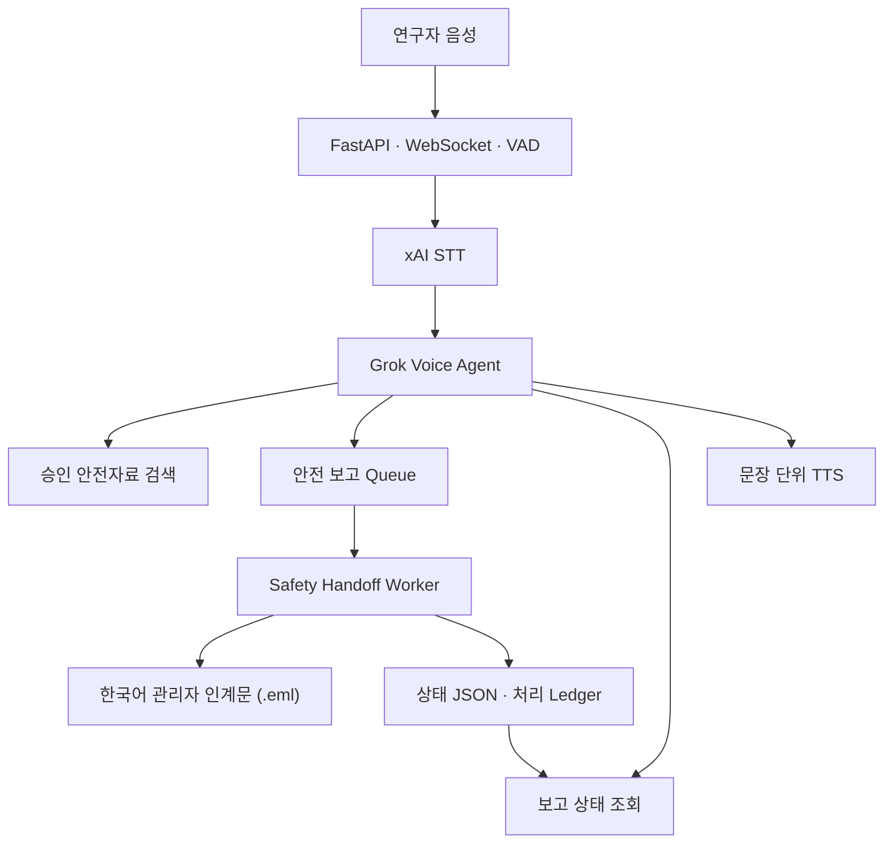

# Voice Workflow Agent

**장갑은 그대로, 기록과 인계는 음성으로.**

Voice Workflow Agent는 신규 연구자가 승인된 안전 정보를 음성으로 확인하고,
위험·이상 상황을 구조화하여 연구실 관리자에게 인계할 수 있도록 돕는  
**Hands-free Voice Safety Dispatcher**입니다.

단순히 안전 질문에 답하는 음성 챗봇이 아니라 다음 과정을 하나의 대화 안에서 연결합니다.

1. 승인된 안전자료 검색
2. 누락된 사고 정보 확인
3. 구조화된 안전 보고 생성
4. 별도 Worker를 통한 관리자 인계문 작성
5. 보고 처리 상태 확인

> **현재 상태:** 6주 Voice AI Agent 과정에서 개발 중인 연구실 안전 PoC입니다.  
> 포함된 안전자료는 기능 검증용 데모 데이터이며 실제 안전 규정이나 현장 승인문서를 대체하지 않습니다.

---

## 프로젝트가 해결하려는 문제

신규 연구자나 외국인 연구자는 실험 도중 다음과 같은 문제를 겪을 수 있습니다.

- 장갑이나 보호장비를 착용한 상태에서 문서와 화면을 조작하기 어렵다.
- 긴 안전 매뉴얼에서 필요한 내용을 즉시 찾기 어렵다.
- 한국어 안전 문서와 보고 절차를 이해하기 어렵다.
- 위험 상황을 관리자에게 전달할 때 위치, 긴급도, 노출 여부가 누락될 수 있다.
- 음성 안내가 끝난 뒤 실제 보고와 관리자 인계가 이어지지 않는다.

Voice Workflow Agent는 음성을 입력 인터페이스로 사용하면서도, 중요한 작업은 검증 가능한 Tool과 구조화된 기록으로 처리합니다.

---

## 핵심 기능

| 기능 | 설명 |
|---|---|
| Hands-free 음성 대화 | WebSocket과 VAD를 이용하여 버튼을 계속 누르지 않고 발화 |
| STT → Grok → TTS | 연구자의 음성을 텍스트로 변환하고 짧은 음성 답변 생성 |
| 한·베 언어 지원 | 한국어와 베트남어 입력을 동일한 Tool workflow로 처리 |
| 승인자료 검색 | 로컬 안전자료에서 확인된 내용만 검색하여 답변 |
| 구조화된 안전 보고 | 위치, 상황, 긴급도, 노출 여부를 확인한 뒤 JSONL Queue에 기록 |
| 관리자 인계 Worker | 음성 응답 경로와 분리된 Worker가 한국어 관리자 인계문 생성 |
| 보고 상태 조회 | 보고 ID를 이용하여 대기, 처리, 재시도, 완료 상태 확인 |
| Tool Chaining | 안전자료를 검색한 뒤 같은 Turn에서 안전 보고까지 연결 |
| 중복 보고 방지 | 60초 이내 동일한 보고는 기존 보고 ID를 반환 |
| 감사 가능한 기록 | Queue, 상태 JSON, 처리 Ledger, `.eml` 인계문을 파일로 보존 |

---

## 동작 구조



Voice Agent와 Safety Handoff Worker는 역할과 실행 프로세스가 분리되어 있습니다.

- Voice Agent는 사용자와 대화하며 Tool을 선택합니다.
- `create_safety_report`는 보고서를 Queue에 빠르게 기록하고 보고 ID를 반환합니다.
- 시간이 필요한 관리자 인계문 작성은 별도 Worker에서 처리합니다.
- 사용자는 음성으로 이전 보고의 처리 상태를 확인할 수 있습니다.

---

## 제공되는 Tool

### `search_approved_safety_manual`

승인된 로컬 안전자료를 검색합니다.

- 입력: 검색어, 사용자 언어
- 지원 언어: 한국어(`ko`), 베트남어(`vi`)
- 출력: 관련 안전자료 최대 3개
- 검색 결과가 없으면 내용을 추측하지 않고 관리자 확인을 안내합니다.

### `create_safety_report`

위험, 누출, 노출 우려, Near Miss, 장비 이상 등의 상황을 구조화하여 기록합니다.

필수 정보:

- 위치
- 상황 요약
- 긴급도
- 노출 여부
- 사용자 언어

선택 정보:

- 화학물질 또는 장비 이름

성공하면 다음 형식의 보고 ID를 반환합니다.

```text
SR-YYYYMMDD-XXXXXX
```

### `check_safety_report_status`

이전에 생성한 보고의 처리 상태를 확인합니다.

| 내부 상태 | 의미 |
|---|---|
| `queued_for_handoff` | 관리자 인계 대기 |
| `processing` | 관리자 인계문 작성 중 |
| `retry_pending` | 인계문 작성 재시도 대기 |
| `handoff_ready` | 관리자 인계문 준비 완료 |
| `failed` | 최대 재시도 후 처리 실패 |

---

## 사용자 시나리오

### 1. 승인자료 확인

```text
사용자:
아세톤으로 보이는 용액이 바닥에 흘렀어. 어떻게 해야 해?

Voice Workflow Agent:
승인된 로컬 안전자료를 먼저 검색한 뒤,
작업 중지와 관리자 연락 등 확인된 내용만 안내합니다.
```

### 2. 긴급 안전 보고

```text
사용자:
3층 유기화학실 후드 앞에서 아세톤으로 보이는 용액이 새고 있어.
노출 여부는 모르겠고 긴급하게 확인이 필요해.
```

Agent는 필요한 정보가 갖춰졌는지 확인하고 보고서를 생성한 뒤 보고 ID를 말합니다.

```text
보고가 접수되었습니다.
보고 ID는 SR-20260722-A1B2C3입니다.
```

### 3. 보고 상태 확인

```text
사용자:
방금 보고가 관리자에게 인계됐어?
```

Agent는 이전 대화에 저장된 보고 ID를 이용하여 Queue와 Worker 상태를 조회합니다.

---

## 안전 설계 원칙

Voice Workflow Agent는 다음 경계를 항상 유지하도록 설계되었습니다.

- 사용자에게서 듣지 않은 사실은 추측하지 않습니다.
- 위치, 긴급도, 노출 여부 등 필수 정보가 없으면 다시 질문합니다.
- 승인자료에 없는 절차, 수치, 전화번호, 규정을 생성하지 않습니다.
- 연구실이나 장비가 안전하다고 판정하지 않습니다.
- 작업 재개를 승인하지 않습니다.
- 보고서 생성이 기존 비상 연락 체계를 대체한다고 말하지 않습니다.
- 즉각적인 위험이 의심되면 작업 중지, 위험원과의 거리 확보, 기존 비상 연락을 우선 안내합니다.
- Tool 선택 과정의 내부 텍스트는 화면이나 TTS에 노출하지 않습니다.
- 관리자 인계문에는 확인된 사실과 확인되지 않은 정보를 구분합니다.

---

## 기술 스택

| 영역 | 사용 기술 |
|---|---|
| Backend | Python 3.12+, FastAPI, Uvicorn |
| 실시간 통신 | WebSocket |
| 음성 감지 | WebRTC VAD |
| STT·TTS | xAI Speech API |
| Voice Agent | Grok Chat Completion, OpenAI Python SDK |
| Tool Calling | Strict JSON Schema, 반복 가능한 Tool Loop |
| Streaming | 문장 단위 TTS Segment |
| Queue | JSONL 파일 Queue |
| Worker | 별도 Python 프로세스 |
| 상태·인계 기록 | JSON, Ledger, RFC 5322 `.eml` |
| Frontend | Vanilla HTML, CSS, JavaScript |
| Test | Python `unittest` |

---

## 저장소 구조

```text
voice-ai-course/
├── voice-workflow-agent/
│   ├── src/voice_workflow_agent/
│   │   ├── server.py          # FastAPI, WebSocket, STT·TTS 처리
│   │   ├── brain.py           # Persona, Memory, Tool Loop
│   │   ├── tools.py           # 안전자료 검색·보고·상태 Tool
│   │   ├── worker.py          # 관리자 인계문 생성 Worker
│   │   ├── audio.py           # PCM framing과 오디오 처리
│   │   ├── protocol.py        # WebSocket 이벤트 프로토콜
│   │   ├── vad.py             # VAD와 발화 Endpoint 감지
│   │   └── static/
│   │       └── index.html     # 반응형 Voice Workspace
│   ├── data/
│   │   └── approved_safety_manual.demo.json
│   ├── docs/
│   │   ├── M2_DISPATCHER_PLAN.md
│   │   └── WEB_WIREFRAMES.md
│   ├── reports/               # Queue, 상태, 처리 Ledger
│   ├── outbox/                # 검토용 관리자 인계문
│   ├── tests/
│   ├── .env.example
│   ├── pyproject.toml
│   └── README.md
├── lectures/
│   ├── week1.md
│   ├── week2.md
│   ├── week3.md
│   ├── week4.md
│   ├── week5.md
│   └── week6.md
├── SYLLABUS.md
├── slides.html
└── README.md
```

---

## 설치

### 요구사항

- Python 3.12 이상
- xAI API Key
- 마이크 사용이 가능한 브라우저

저장소를 내려받고 프로젝트 디렉터리로 이동합니다.

```bash
git clone https://github.com/jaeiko/voice-ai-course.git
cd voice-ai-course
git switch phase6-workflow-copilot
cd voice-workflow-agent
```

가상환경을 만들고 패키지를 설치합니다.

```bash
python3.12 -m venv .venv
source .venv/bin/activate
python -m pip install --upgrade pip
python -m pip install -e .
```

---

## 환경 변수 설정

예제 파일을 복사합니다.

```bash
cp .env.example .env
```

`.env`에 자신의 값을 입력합니다.

```dotenv
XAI_API_KEY=replace-with-your-key
XAI_BASE_URL=https://api.x.ai/v1
CHAT_MODEL=grok-4
WORKER_MODEL=grok-4
TTS_VOICE=replace-with-an-xai-voice-id
LAB_MANAGER_EMAIL=lab-manager@example.invalid
VOICE_WORKFLOW_AGENT_FROM_EMAIL=voice_workflow_agent@example.invalid
```

실제 API Key가 포함된 `.env`는 Git에 커밋하지 않습니다.

---

## 실행

Voice Agent와 Safety Handoff Worker를 서로 다른 터미널에서 실행합니다.

### 터미널 1: Voice Agent

```bash
cd voice-workflow-agent
source .venv/bin/activate
uvicorn voice_workflow_agent.server:app --reload
```

### 터미널 2: Safety Handoff Worker

```bash
cd voice-workflow-agent
source .venv/bin/activate
python -m voice_workflow_agent.worker
```

현재 Queue에 있는 보고만 처리하고 종료하려면 다음 명령을 사용합니다.

```bash
python -m voice_workflow_agent.worker --once
```

### 브라우저

```text
http://localhost:8000
```

브라우저에서 `세션 시작`을 한 번 누른 뒤 음성으로 대화합니다.

원격 VM에서 실행할 경우 로컬 브라우저가 VM의 `8000` 포트에 접근할 수 있도록 SSH Port Forwarding을 설정해야 합니다.

---

## 생성되는 산출물

| 경로 | 내용 |
|---|---|
| `reports/inbox.jsonl` | Voice Agent가 접수한 구조화된 안전 보고 |
| `reports/status/<report-id>.json` | Worker 처리 상태와 시도 횟수 |
| `reports/processed.txt` | 성공적으로 처리된 보고 ID |
| `outbox/<report-id>.eml` | 관리자가 검토할 수 있는 한국어 인계문 |

현재 `.eml`은 로컬 검토용 산출물입니다. 실제 이메일이나 알림을 자동으로 전송하지 않습니다.

Queue를 실시간으로 확인하려면 다음 명령을 사용할 수 있습니다.

```bash
tail -f reports/inbox.jsonl
```

---

## 자동 검증

테스트는 실제 STT, Grok, TTS 네트워크 호출 없이 실행됩니다.

```bash
cd voice-workflow-agent
source .venv/bin/activate

python -m unittest discover -s tests -v
python -m compileall -q src tests

python -c "from voice_workflow_agent.server import app"
python -c "import voice_workflow_agent.worker"
python -c "import voice_workflow_agent.tools"
```

현재 구현 기준으로 **46개의 자동화 테스트**가 다음 영역을 검증합니다.

- PCM FrameBuffer와 오디오 framing
- WebRTC VAD와 발화 Endpoint
- 세션 상태와 cooldown
- WebSocket Protocol
- Conversation Memory
- Tool-call 메시지 순서
- 최대 4회의 Tool Round
- Tool 선택 과정의 텍스트 비노출
- 엄격한 Tool 인자 검증
- JSONL Queue 기록
- 60초 중복 보고 방지
- Worker 긴급도 우선순위
- `.eml` 및 처리 Ledger 생성
- 최대 3회 재시도와 실패 상태
- 세션 재시작과 stale event 격리
- 웹 화면의 Tool·보고 상태 표시

---

## 현재 PoC의 제한사항

현재 버전은 기능과 구조 검증을 위한 PoC이며 다음 기능은 포함하지 않습니다.

- 실제 연구실 공식 SOP·MSDS 연동
- 실제 SMTP 이메일 전송
- 전화·문자·메신저 관리자 알림
- 사용자 인증과 역할 기반 권한
- 데이터베이스 및 암호화 저장
- 관리자 검토·승인 Dashboard
- 보고 수정 및 담당자 배정 workflow
- 작업 재개 승인
- 실제 연구실 소음 환경에 대한 충분한 현장 검증
- 화학물질명, 숫자, 단위에 대한 전문 STT 평가
- 전 구간 베트남어 현장 검증
- Native Speech-to-Speech 및 Barge-in

---

## 향후 확장 방향

1. 데모 안전자료를 연구실별 승인 SOP와 MSDS로 교체
2. 출처와 문서 버전을 포함하는 RAG 검색 도입
3. 관리자 검토·수정·승인 Dashboard 구현
4. 실제 알림 채널과 인증된 수신자 연결
5. 보고 데이터의 암호화와 접근권한 관리
6. 한국어·베트남어 기능 동등성 평가
7. 연구실 소음과 보호장비 환경에서 STT·VAD 검증
8. Native Speech-to-Speech와 Barge-in 적용
9. 제조·화학·배터리 작업 현장으로 적용 범위 확장

---

## Voice AI 과정과의 관계

Voice Workflow Agent는 6주 Real-Time Voice AI Agent 과정에서 학습한 구조를 실제 안전 workflow로 확장한 프로젝트입니다.

| 주차 | Milestone | 주요 내용 |
|---|---|---|
| Week 1 | M1 Talkbox | Push-to-talk STT → Grok → TTS |
| Week 2 | M2 Plumber | WebSocket과 연속 오디오 Streaming |
| Week 3 | M3 Listener | VAD 기반 Hands-free Turn-taking |
| Week 4 | M4 Brain | Tool Calling, Persona, Memory, 문장 단위 TTS |
| Week 5 | M5 Survivor | Native Speech-to-Speech, Barge-in, Watchdog |
| Week 6 | Demo Day | 실제 대화, Tool Call, Barge-in 시연 |

강의 자료:

- [Course Syllabus](SYLLABUS.md)
- [Lecture Slides](slides.html)
- [Course Overview](course-overview.html)
- [Week 1–6 Lecture Notes](lectures/)
- [Historical Week 1 Starter Code](https://github.com/jaeiko/voice-ai-course/tree/main/starter-code/week1-talkbox)

---

## 상세 문서

- [Voice Workflow Agent 실행 및 데모 가이드](voice-workflow-agent/README.md)
- [M2 Dispatcher 설계](voice-workflow-agent/docs/M2_DISPATCHER_PLAN.md)
- [Web UI Wireframes](voice-workflow-agent/docs/WEB_WIREFRAMES.md)
- [전체 강의 계획](SYLLABUS.md)
