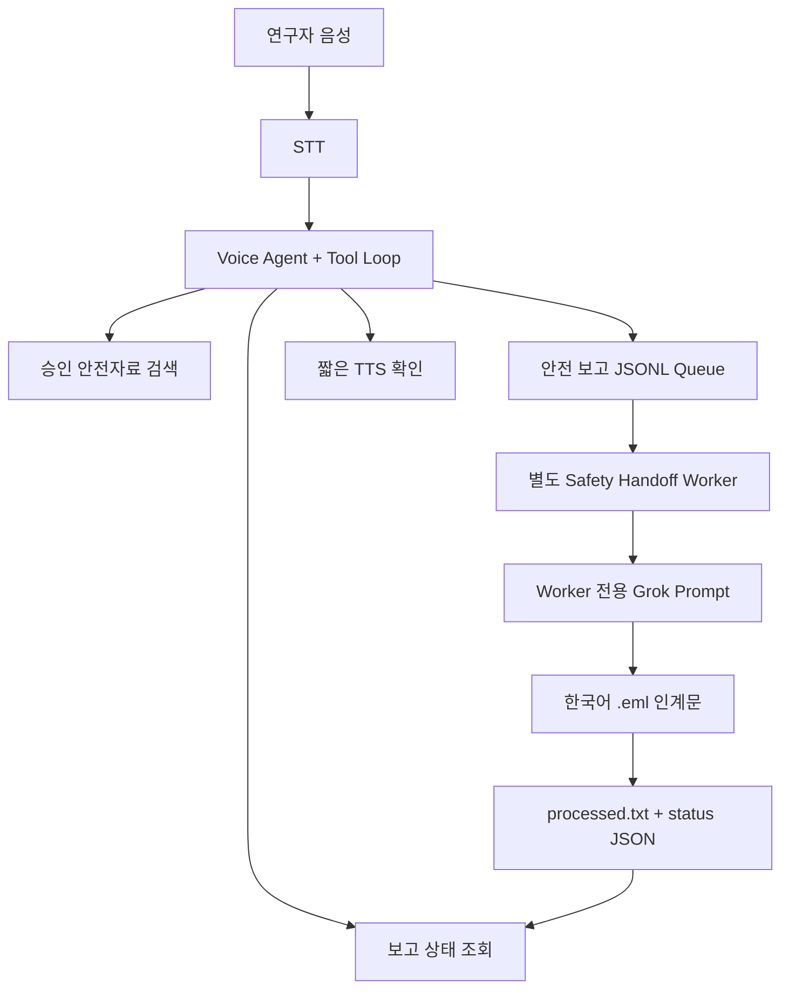
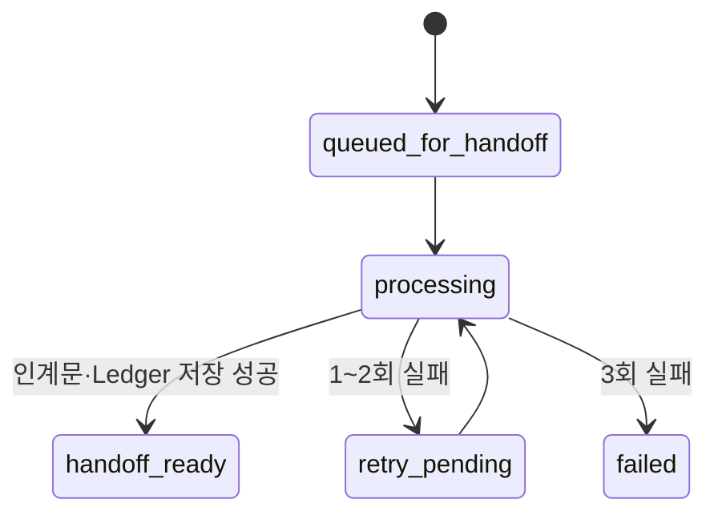

# SafeBridge Voice M2 Dispatcher 구현 계획

## 1. 공식 과제와 프로젝트 대응

| 공식 M2 Dispatcher | SafeBridge Voice |
|---|---|
| `file_maintenance_ticket` | `create_safety_report` |
| `check_ticket_status` | `check_safety_report_status` |
| `tickets/inbox.jsonl` | `reports/inbox.jsonl` |
| Maintenance Worker | Safety Handoff Worker |
| Work-order email | 한국어 연구실 관리자 인계문 |
| `tickets/processed.txt` | `reports/processed.txt` |
| `outbox/T-1000.eml` | `outbox/SR-YYYYMMDD-XXXXXX.eml` |

기존 `search_approved_safety_manual`은 유지한다. 따라서 SafeBridge Voice은
공식 과제의 두 Tool에 승인자료 검색 Tool을 더한 세 Tool 구조다.

## 2. 실행 구조


Voice Agent와 Worker는 프로세스·Prompt·역할이 분리된다. Voice Tool은 파일에
한 줄을 기록하고 즉시 보고 ID를 반환한다. 느린 LLM 인계문 작성은 사용자가
기다리지 않는 Worker에서 처리한다.

## 3. Tool 계약

### `search_approved_safety_manual`

- 입력: `query`, `language`
- 데이터: 로컬 승인자료 데모 JSON
- 출력: 최대 3개 근거 또는 `not_found`
- 네트워크 호출 없음

### `create_safety_report`

- 필수 입력: `location`, `summary`, `urgency`, `exposure_status`, `language`
- 선택 입력: `material_or_equipment`
- 출력: `report_id`, `queued_for_handoff`, `deduplicated`
- 동작: `reports/inbox.jsonl`에 한 줄 추가
- 보호: 60초 내 동일 보고는 같은 ID로 중복 제거

### `check_safety_report_status`

- 입력: `report_id`
- 출력: Queue·Worker 상태, 긴급도, 위치, 시도 횟수
- 보고서 본문이나 관리자 인계문 전체는 음성 경로에 반환하지 않음

## 4. Queue와 Worker 상태

Queue 한 줄의 예시는 다음과 같다.

```json
{"id":"SR-20260722-A1B2C3","location":"3층 유기화학실 후드 앞","summary":"용액 누출이 관찰됨","urgency":"urgent","exposure_status":"unknown","language":"ko","material_or_equipment":"아세톤","filed_at":"2026-07-22T06:00:00+00:00","filed_at_epoch":1784700000.0,"dedupe_key":"..."}
```

Worker 상태 전이는 다음과 같다.



- `processed.txt`는 성공한 보고 ID만 기록한다.
- `.eml`은 임시 파일에 먼저 쓴 뒤 원자적으로 교체한다.
- 긴급 보고는 같은 Poll에 들어온 일반 보고보다 먼저 처리한다.
- 실제 SMTP 전송과 자동 수신자 연락은 PoC 범위에서 제외한다.

## 5. Definition of Done

1. 음성으로 위치·상황·긴급도·노출 여부를 제공한다.
2. `create_safety_report`가 빠르게 실행되고 보고 ID를 말한다.
3. `reports/inbox.jsonl`에 정확히 한 줄이 추가된다.
4. 별도 `worker.py`가 Worker 전용 Grok Prompt로 한국어 인계문을 만든다.
5. `outbox/<report_id>.eml`과 `reports/processed.txt`가 생성된다.
6. 같은 세션에서 상태를 물으면 `handoff_ready`를 근거로 답한다.
7. Tool-call assistant 메시지 뒤에 동일 ID의 tool result가 보존된다.
8. 승인자료 검색 후 보고 생성처럼 여러 Tool Round를 연결할 수 있다.
9. 긴급·일반 요청을 각각 한 건씩 데모한다.
10. 자동 테스트는 외부 API 호출 없이 통과한다.

## 6. 재현용 Codex 프롬프트

아래 프롬프트는 같은 구현을 VM의 `week4-brain` 기준 코드에 다시 적용하거나
검토할 때 사용할 수 있다.

```text
역사적 `week4-brain` 브랜치의 구현을 읽고, 기존 M3 Hands-free VAD와
M4 Streaming TTS·Memory·search_approved_safety_manual 동작을 보존한 채
SafeBridge Voice용 M2 Dispatcher를 통합해줘.

요구사항:
1. 원본 week4-brain은 수정하지 말고 safebridge-voice에 복사해 작업한다.
2. create_safety_report와 check_safety_report_status Tool JSON Schema를 추가한다.
3. create_safety_report는 location, summary, urgency, exposure_status, language를
   검증하고 reports/inbox.jsonl에 한 줄만 추가한 뒤 즉시 report_id를 반환한다.
4. 60초 내 동일 인자의 중복 호출은 새 보고를 만들지 말고 기존 ID를 반환한다.
5. brain.py를 최대 4회의 반복 가능한 Tool-call Loop로 바꾸고 assistant tool-call
   메시지 다음에 tool result를 정확한 tool_call_id로 추가한다. JSON 문자열 인자는
   json.loads로 파싱하며 Tool 선택 중 텍스트는 TTS로 읽지 않는다.
6. worker.py를 별도 프로세스로 만들고, Worker 전용 System Prompt와 Grok 호출로
   한국어 관리자 인계문을 생성해 outbox/<report_id>.eml에 저장한다.
7. 성공한 ID만 reports/processed.txt에 기록하고, 보고별 status JSON에 processing,
   retry_pending, handoff_ready, failed 상태와 시도 횟수를 원자적으로 기록한다.
8. 긴급 보고를 우선 처리하고 최대 3회까지만 재시도한다. 실제 SMTP는 구현하지 않는다.
9. 기존 WebSocket tool.call/tool.result 이벤트를 웹 화면에 표시하고 최근 report_id와
   인계 상태를 보여준다. 모바일·태블릿에서도 한 열로 사용할 수 있어야 한다.
10. tools, worker, 다중 Tool Round, 기존 VAD·Audio·Protocol·Frontend 회귀 테스트를
    추가 또는 수정하고 외부 API 없이 전체 테스트를 실행한다.
11. README에 세 터미널 실행법, 긴급·일반 데모, 산출물, 제한사항을 기록한다.

.env와 API 키는 읽거나 출력하지 말고, 기존 사용자 변경을 덮어쓰지 마. 구현 후
git diff와 테스트 결과를 요약하되 커밋·푸시는 하지 마.
```
