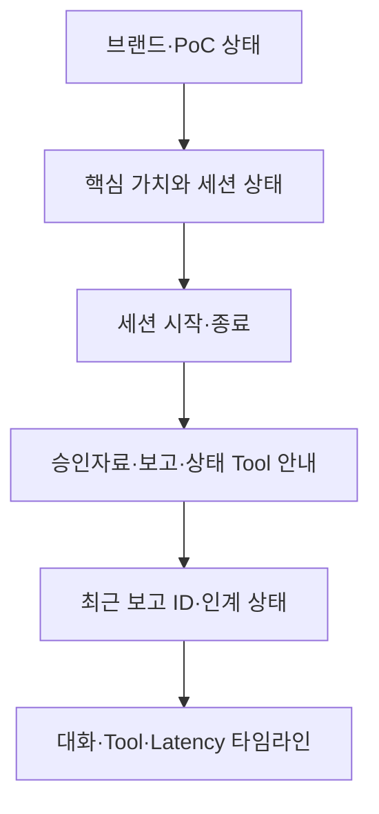

# SafeBridge Lab Web 화면 설계

## 1. UI 결정

6주 PoC는 **반응형 단일 연구자 화면**을 우선한다. 사용자는 실험 시작 전에
한 번 세션을 켜고, 이후에는 음성으로 승인자료 검색·이상상황 보고·인계 상태
확인을 수행한다. 화면은 조작 중심 앱이 아니라 음성 결과를 확인하는 보조판이다.

- 1차 사용자: 신규 Wet-lab 학부연구생·인턴·석사 신입생
- 1차 기기: 연구실 안전 구역의 태블릿, 노트북 또는 스마트폰
- 입력: 세션 시작 후 Hands-free 음성
- 출력: 짧은 TTS와 화면의 원문·Tool·보고 ID·Latency
- 앱 형태: 설치 없는 반응형 Web

## 2. 화면 우선순위

| 우선순위 | 화면 | 이번 PoC | 목적 |
|---|---|---:|---|
| P0 | Researcher Voice Workspace | 구현 | 세션 시작, 상태 확인, 음성 대화, Tool 실행 확인 |
| P0 | Safety Report Status Card | Workspace에 통합 | 보고 ID와 Queue·Worker 상태 확인 |
| P1 | Manager Handoff Artifact | `.eml` 결과물로 구현 | 구조화된 한국어 인계문 검토 |
| P2 | Manager Review Dashboard | 제외 | 보고 목록, 승인, 담당자 배정 |
| P2 | Lab Setup / SOP Admin | 제외 | 연구실별 승인문서 등록 및 권한 관리 |

관리자 Dashboard와 SOP 관리 화면은 실제 관리자 인터뷰 전에는 만들지 않는다.
현재 M2의 핵심은 별도 Worker가 사람이 검토할 수 있는 결과물을 생성하는지
검증하는 것이다.

## 3. Researcher Voice Workspace

### 첫 화면

- 가장 큰 문장: `장갑은 그대로, 기록과 인계는 음성으로.`
- 세션 상태: `IDLE / CONNECTING / LISTENING / THINKING / SPEAKING / ERROR`
- 주 동작: `세션 시작`
- 보조 동작: `종료`
- 항상 보이는 안전문: 즉시 위험 시 기존 비상 연락·대피 절차 우선

### Tool 안내

- `SEARCH`: 승인된 로컬 안전자료 검색
- `QUEUE`: 위치·상황·긴급도·노출 여부를 JSONL에 빠르게 접수
- `STATUS`: Queue와 별도 Worker의 처리 상태 확인

### 타임라인

각 Turn은 다음 정보를 같은 묶음으로 표시한다.

1. STT가 인식한 사용자 발화
2. 최종 사용자용 답변
3. 실행 중이거나 완료된 Tool 이름과 실행시간
4. STT·첫 음성·전체·Tool Latency

Tool 선택 중 모델이 생성한 내부 텍스트는 화면과 TTS에 노출하지 않는다.

## 4. 상태 표현

| 시스템 상태 | 사용자에게 보이는 표현 | 허용 동작 |
|---|---|---|
| IDLE | 준비됨 | 세션 시작 |
| CONNECTING | 마이크 연결 중 | 종료 |
| LISTENING | 듣고 있음 | 음성 발화, 종료 |
| THINKING | 승인자료·보고 작업 확인 중 | 종료 |
| SPEAKING | 답변 중 | 듣기, 종료 |
| ERROR | 재시작 필요 | 세션 시작 |

보고 상태는 연구자 화면에서 다음처럼 번역한다.

| 내부 상태 | 화면 표시 |
|---|---|
| `queued_for_handoff` | 관리자 인계 대기 |
| `processing` | 관리자 인계문 작성 중 |
| `retry_pending` | 인계문 작성 재시도 대기 |
| `handoff_ready` | 관리자 인계문 준비 완료 |
| `failed` | 인계문 작성 실패 |

## 5. 반응형 기준

- Desktop/Tablet: Voice Workspace와 기능·보고 상태를 2열로 배치한다.
- Mobile: 모든 영역을 1열로 전환하고 시작·종료 버튼을 전체 너비로 둔다.
- 화면 크기와 관계없이 세션 상태, 안전문, 보고 ID를 첫 화면에서 확인한다.
- 색만으로 상태를 구분하지 않고 상태 문자열을 함께 표시한다.

## 6. 구현 위치

현재 P0 화면은 `static/index.html`에 구현한다. 별도 프론트엔드 프레임워크를
추가하지 않아 기존 FastAPI·WebSocket 실습 구조와 실행 방법을 유지한다.
